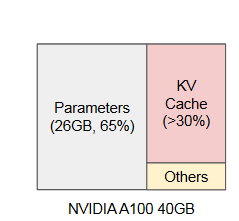

# 使用 PagedAttention 进行大型语言模型的高效内存管理

### 摘要

大型语言模型 (LLM) 的高吞吐量服务需要一次批处理足够多的请求。然而，现有系统很困难，因为每个请求的键值缓存（KV 缓存）内存巨大，并且会动态增长和收缩。如果管理效率低下，这些内存可能会因碎片和冗余重复而被严重浪费，从而限制了批处理大小。为了解决这个问题，我们提出了 PagedAttention，这是一种受操作系统中经典虚拟内存和分页技术启发的注意力算法。在此基础上，我们构建了 vLLM，这是一个 LLM 服务系统，它实现了（1）KV 缓存内存几乎为零的浪费，以及（2）在请求内和请求之间灵活共享 KV 缓存，以进一步减少内存使用。我们的评估表明，与 FasterTransformer 和 Orca 等最先进的系统相比，在相同延迟水平下，vLLM 将流行 LLM 的吞吐量提高了 2-4 倍。对于更长的序列、更大的模型和更复杂的解码算法，这种改进更加明显。 vLLM 的源代码可在 https://github.com/vllm-pro

### 0. KV cache

### 1. 引入

GPT [5, 37] 和 PaLM [9] 等大型语言模型 (LLM) 的出现启用了编程助手 [6, 18] 和通用聊天机器人 [19, 35] 等新应用程序，这些应用程序开始对我们的工作产生深远影响和日常生活。许多云公司 [34, 44] 竞相以托管服务的形式提供这些应用程序。然而，运行这些应用程序的成本非常昂贵，需要大量的硬件加速器，例如 GPU。根据最近的估计，处理 LLM 请求的成本可能比传统关键字查询高 10 倍 [43]。考虑到这些高成本，提高吞吐量——从而减少LLM 服务系统的每次请求成本变得越来越重要。

LLM 的核心是自回归 Transformer 模型 [53]。该模型根据输入（提示）和迄今为止生成的输出标记的前一个序列，一次生成一个单词（标记）。对于每个请求，都会重复这个昂贵的过程，直到模型输出终止令牌。这种顺序生成过程使工作负载受到内存限制，无法充分利用 GPU 的计算能力并限制服务吞吐量。

通过将多个请求一起批处理可以提高吞吐量。然而，为了批量处理许多请求，应该有效地管理每个请求的内存空间。例如，图 1（左）展示了 13B 参数 LLM 在具有 40GB RAM 的 NVIDIA A100 GPU 上的内存分布。大约 65% 的内存分配给模型权重，这些权重在服务期间保持静态。接近 30% 的内存用于存储请求的动态状态。对于 Transformer 来说，这些状态由与注意力机制相关的键和值张量组成，通常称为 KV 缓存 [41],它代表早期令牌的上下文，以按顺序生成新的输出令牌。剩下的一小部分用于其他数据，包括激活——评估 LLM 时创建的临时张量。由于模型权重是恒定的，并且激活仅占用 GPU 内存的一小部分，因此管理 KV 缓存的方式对于确定最大批量大小（Max batch size）至关重要。当管理效率低下时，KV 缓存内存会显着限制批量大小，从而限制 LLM 的吞吐量，如图 1（右）所示。

> 左：在 NVIDIA A100 上提供具有 13B 参数的 LLM 时的内存布局。在整个服务过程中，参数（灰色）始终保留在 GPU 内存中。 KV 缓存（红色）的内存根据服务请求进行分配（取消）分配。少量内存（黄色）暂时用于激活。

> 右图：vLLM 平滑了现有系统中 KV 缓存的快速增长曲线 [31, 60]，从而显着提高了服务吞吐量。

在本文中，我们观察到现有的 LLM 服务系统 [31, 60] 无法有效管理 KV 缓存。这主要是因为它们将请求的 KV 缓存存储在连续的内存空间中，因为大多数深度学习框架 [33, 39] 要求张量存储在连续的内存中。然而，与传统深度学习工作负载中的张量不同，KV 缓存具有独特的特性：随着模型生成新令牌，它会随着时间动态增长和收缩，并且其生命周期和长度是事先未知的。这些特征使现有系统的方法在两个方面显着低效：

首先，现有系统 [31, 60] 存在内部和外部内存碎片的问题。为了将请求的 KV 缓存存储在连续空间中，他们预先分配了具有请求最大长度（例如 2048 个令牌）的连续内存块。这可能会导致严重的内部碎片，因为请求的实际长度可能比其最大长度短得多（例如图 11）。

此外，即使先验知道实际长度，预分配仍然效率低下：由于整个块在请求的生命周期内被保留，其他较短的请求无法利用当前未使用的块的任何部分。此外，外部内存碎片也可能很重要，因为每个请求的预分配大小可能不同。事实上，我们在图 2 中的分析结果表明，现有系统中只有 20.4% - 38.2% 的 KV 缓存用于存储实际令牌状态。

其次，现有系统无法利用内存共享的机会。 LLM 服务通常使用先进的解码算法，例如并行采样和波束搜索，为每个请求生成多个输出。在这些场景中，请求由多个序列组成，这些序列可以部分共享其 KV 缓存。然而，在现有系统中，内存共享是不可能的，因为序列的 KV 缓存存储在单独的连续空间中。

为了解决上述限制，我们提出了 PagedAttention，这是一种受操作系统（OS）内存碎片和共享解决方案启发的注意力算法：具有分页的虚拟内存。

 PagedAttention 将请求的 KV 缓存划分为块，每个块可以包含固定数量 token 的注意力键和值。在PagedAttention中，KV缓存的块不一定存储在连续的空间中。因此，我们可以像操作系统的虚拟内存一样以更灵活的方式管理KV缓存：

**可以将块视为页面，将令牌视为字节，将请求视为进程。**

这种设计通过使用相对较小的块并按需分配来减少内部碎片。此外，它**消除了外部碎片**，因为所有块都具有相同的大小。最后，它支持**以块为粒度**、跨与同一请求关联的不同序列甚至跨不同请求的**内存共享**。

在这项工作中，我们构建了 vLLM，这是一个基于 PagedAttention 的高吞吐量分布式 LLM 服务引擎，可实现 KV 缓存内存的近乎零浪费。 vLLM 使用与 PagedAttention 共同设计的块级内存管理和抢占式请求调度。 vLLM 支持各种大小的流行 LLM，例如 GPT [5]、OPT [62] 和 LLaMA [52]，包括超出单个 GPU 内存容量的 LLM。我们对各种模型和工作负载的评估表明，与最先进的系统相比，vLLM 将 LLM 服务吞吐量提高了 2-4 倍 [31, 60]，而且完全不影响模型的准确性。对于更长的序列、更大的模型和更复杂的解码算法，改进更加明显（第 4.3 节）。总之，我们做出以下贡献：

• 我们确定了为LLM提供服务时内存分配方面的挑战，并量化了它们对服务性能的影响。 

• 我们提出PagedAttention，这是一种对存储在非连续分页内存中的KV 缓存进行操作的注意力算法，其灵感来自操作系统中的虚拟内存和分页。 

• 我们设计并实现了vLLM，这是一个构建在PagedAttention 之上的分布式LLM 服务引擎。 

• 我们在各种场景下评估vLLM，并证明它大大优于以前最先进的解决方案，例如FasterTransformer [31] 和Orca [60]。

### 2. 背景

在本节中，我们描述典型 LLM 的生成和服务过程以及 LLM 服务中使用的迭代级调度。

#### 2.1 基于 Transformer 的大型语言模型（略）

#### 2.2 LLM 服务和自回归生成

经过训练后，LLM 通常会部署为条件生成服务（例如，完成 API [34] 或聊天机器人 [19, 35]）。对LLM服务的请求提供输入提示标记（x1，...，xn）的列表，并且LLM服务根据等式1生成输出标记（xn+1，...，xn+T）列表。我们将提示和输出列表的串联称为序列。

由于方程中的分解。 1、LLM只能一一采样并生成新的token，每个新token的生成过程取决于该序列中所有先前的token，特别是它们的键和值向量。在这个顺序生成过程中，现有令牌的键和值向量通常被缓存以用于生成未来的令牌，称为KV缓存。请注意，一个令牌的 KV 缓存取决于其之前的所有令牌。这意味着同一个token在一个序列中不同位置出现的KV缓存会不同。

给定**请求提示**（prompt），LLM 服务中的生成计算可以分解为两个阶段：

提示阶段将整个用户提示(x1,...,xn)作为输入，并计算第一个新标记P(xn+1 | x1,...,xn)的概率。在此过程中，还生成密钥向量k1，…。 。 。 、kn 和值向量 v1, . 。 。 ，vn。由于提示标记 x1，. 。 。 , xn 都是已知的，提示阶段的计算可以使用矩阵矩阵乘法运算并行化。因此，这个阶段可以有效地利用GPU固有的并行性。

自回归生成阶段依次生成剩余的新令牌。在迭代 t 时，模型将一个标记 xn+t 作为输入，并使用键向量 k1, ... 计算概率 P (xn+t+1 | x1, ..., xn+t )。 。 。 、kn+t 和值向量 v1、. 。 。 , vn+t 。请注意，位置 1 到 n + t − 1 处的键和值向量在之前的迭代中被缓存，在本次迭代中仅计算新的键和值向量 kn+t 和 vn+t。当序列达到最大长度（由用户指定或受 LLM 限制）或发出序列结束 (<eos>) 令牌时，此阶段完成。由于数据依赖性，不同迭代的计算无法并行化，并且经常使用矩阵向量乘法，效率较低。因此，此阶段严重未充分利用 GPU 计算并受到内存限制，是单个请求的延迟的主要组成部分。

#### 2.3 LLM 的批处理技术

为提供LLM服务时，通过对多个请求进行批处理可以改善计算利用率。由于这些请求共享相同的模型权重，将权重移动的开销在一个批次中被摊销到各个请求上，但当批处理大小足够大时，计算开销可能会超过权重移动的开销。

然而，由于两个原因，批量处理对 LLM 服务的请求并非易事。

首先，请求可能会在不同时间到达。幼稚的批处理策略要么让较早的请求等待较晚的请求，要么延迟传入的请求直到较早的请求完成，从而导致严重的排队延迟。其次，请求可能具有截然不同的输入和输出长度（图 11）。一种简单的批处理技术会填充请求的输入和输出以均衡它们的长度，从而浪费 GPU 计算和内存。

为了解决这个问题，人们提出了细粒度的批处理机制，例如单元批处理[16]和迭代级调度[60]。与在请求级别工作的传统方法不同，这些技术在迭代级别工作。每次迭代后，已完成的请求将从批次中删除，并添加新的请求。因此，可以在等待单次迭代后处理新请求，而不是等待整个批次完成。此外，借助特殊的 GPU 内核，这些技术无需填充输入和输出。通过减少排队延迟和填充造成的低效率，细粒度批处理机制显着提高了 LLM 服务的吞吐量。

### 3.LLM 服务中的内存挑战

虽然细粒度批处理减少了计算的浪费，并且能够以更灵活的方式对请求进行批处理，但是可以一起批处理的请求数量仍然受到 GPU 内存容量的限制，特别是分配用于存储 KV 缓存的空间。换句话说，服务系统的吞吐量是受内存限制的。

克服这种内存限制需要解决内存管理中的以下挑战： 大型 KV 缓存。 KV Cache 的大小随着请求数量的增加而快速增长。例如，对于13B参数OPT模型[62]，单个令牌的KV缓存需要800 KB的空间，计算公式为2（键和值向量）×5120（隐藏状态大小）×40（层数） × 2（每个 FP16 字节）。由于OPT最多可以生成2048个token的序列，**因此存储一个请求的KV缓存所需的内存可以高达1.6GB**。并发 GPU 的内存容量可达数十 GB。即使所有可用内存都分配给KV缓存，也只能容纳几十个请求。此外，低效的内存管理会进一步减小批量大小，如图2所示。

此外，考虑到当前的趋势，GPU的计算速度增长速度快于内存容量的增长速度[17]。例如，从 NVIDIA A100 到 H100，FLOPS 增加了 2 倍以上，但 GPU 内存仍保持在 80GB 最大。因此，我们相信内存将成为一个越来越重要的瓶颈。

复杂的解码算法。 LLM 服务提供一系列解码算法供用户选择，每种算法对内存管理复杂性都有不同的影响。

例如，当用户使用同样的问题，请求多次，并将这些略有不同的回答综合考量时（对开发者，我们经常建议这样做），提示部分的 KV 缓存可以只存储一次，在我们的实验中，这个提示部分的KV缓存占总KV缓存内存的12%（见第6.3节），可以共享以最小化内存使用。

另一方面，在自回归生成阶段，KV缓存应保持不共享，因为不同的样本结果及其依赖于上下文和位置。KV缓存的共享程度取决于所采用的具体解码算法。在像束搜索[49]这样更复杂的算法中，不同的请求束可以共享更大部分（最多可节省55%的内存，见第6.3节）的KV缓存，并且共享模式随着解码过程的推进而演变。

**未知输入和输出长度的调度。**

对 LLM 服务的请求在输入和输出长度方面表现出可变性。这要求内存管理系统能够适应各种提示长度。此外，随着解码时请求的输出长度增加，其 KV 缓存所需的内存也会扩展，并且可能会耗尽传入请求或现有提示的持续生成的可用内存。系统需要做出调度决策，例如从GPU内存中删除或换出某些请求的KV缓存。

### 3.1 现有系统中的内存管理

由于当前深度学习框架[33, 39]中的大多数算子都要求将张量存储在连续的内存中，因此以前的LLM服务系统[31, 60]也将一个请求的KV缓存存储为跨内存的连续张量不同的立场。由于 LLM 的输出长度不可预测，它们根据请求的最大可能序列长度为请求静态分配一块内存，而不考虑请求的实际输入或最终输出长度。图 3 说明了两个请求：请求 A 的最大可能序列长度为 2048，请求 B 的最大序列长度为 512。现有系统中的块预分配方案具有三个主要的内存浪费来源：为未来令牌保留的插槽、由于内部碎片而导致的内存浪费。过度配置潜在的最大序列长度，以及来自内存分配器（如伙伴分配器）的外部碎片。外部碎片永远不会用于生成的令牌，这是在服务请求之前已知的。内部碎片也保持未使用状态，但这只有在请求完成采样后才会实现。它们都是纯粹的内存浪费。尽管保留的内存最终会被使用，但在整个请求持续时间内保留该空间，尤其是当保留的空间很大时，会占用原本可用于处理其他请求的空间。我们在图 2 中可视化了实验中内存浪费的平均百分比，表明以前系统中的实际有效内存可能低至 20.4%。

（to be done）

# A survey

摘要——基于 Transformer 的大型语言模型取得了巨大的成功。然而，推理过程中产生的大量内存和计算成本使得在资源受限的设备上部署大型模型变得具有挑战性。在本文中，我们从**算法**的角度研究大型语言模型的压缩和高效推理方法。从分类上看，与较小的模型类似，大型语言模型的压缩和加速算法仍然可以分为量化、剪枝、蒸馏、紧凑架构设计、动态网络等。然而，与较小的模型相比，大型语言模型有两个突出的特征：（1）大多数压缩算法在压缩后需要对模型进行微调甚至重新训练。大型模型最值得注意的方面是与模型微调或训练相关的成本非常高。因此，许多针对大型模型的算法，例如量化和剪枝，开始探索免调优算法。 (2) 大型模型强调多功能性和泛化性，而不是单一任务的性能。因此，许多算法，例如知识蒸馏，重点关注如何在压缩后保留其通用性和泛化性。由于这两个特征在早期的大型模型中并不是很明显，因此我们进一步将大型语言模型分为中型模型和“真正的”大型模型。此外，我们还介绍了一些成熟的大型模型高效推理框架，可以支持基本的压缩或加速算法，极大地方便了用户的模型部署。

## 1. 简介

大型语言模型（LLM）已成为人工智能领域的一个重要且热门的话题。与以前的语言模型相比，LLM（例如 ChatGPT、LLaMA、Claude）对于未见过的数据表现出更强的泛化能力。此外，它们甚至呈现出许多较小模型不呈现的能力（即涌现能力），例如多步推理和指令跟随能力。这些进展表明了LLM的巨大潜力。然而，推理过程中的内存和计算预算也阻碍了LLM的部署。例如，具有 float32 权重的 10B 模型消耗 37GB 内存，不用说，推理内存成本将进一步增加，其速度与序列长度成平方关系。为了在资源受限的设备甚至移动设备上部署模型，许多LLM采用量化等模型压缩方法来减少推理内存和计算成本。深度学习模型的模型压缩是一个比LLM出现得更早的领域。它假设我们已经有一个预定义的（甚至是预训练的）模型。模型压缩致力于减少内存和模型在推理过程中的计算成本，使得模型可以在各种资源受限的设备上运行。从算法上来说，常见的模型压缩方法包括：

•量化将 float32 权重或激活转换为低位浮点或整数。更少的位数意味着更少的内存需求。此外，更少的比特可以指示更高的并行性和更快的推理速度。 

• 剪枝致力于删除预先设计的模型中不重要的组件（例如神经元、层等），从而减少推理成本中的内存和计算成本。 

• 知识蒸馏引入了一个预训练的大型模型作为教师，并将其知识转移到一个新的较小模型（称为学生模型）。然后，较小的模型将具有与教师几乎相同的能力，并且享有更少的内存和计算成本。 

• 紧凑的架构设计以较低的成本设计新的算子来替换（通常近似）原始模型中的繁琐算子。对于 Transformer 模型，自注意力是主要目标，并且经常被其他算子取代。 

• 动态网络以不同的方式对待每个推理样本。原始模型是一个超网，每个样本只选择超网的一个子结构进行推理。专家混合（MoE）是一种动态推理。（稀疏化，不100%调用）

